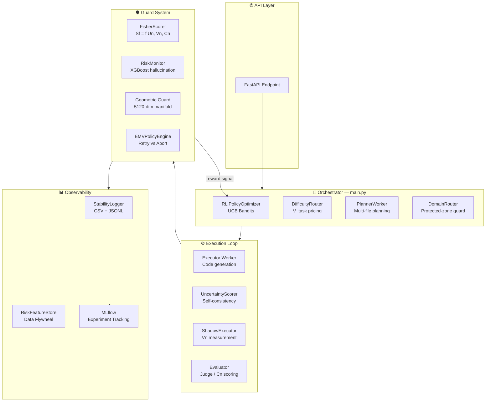
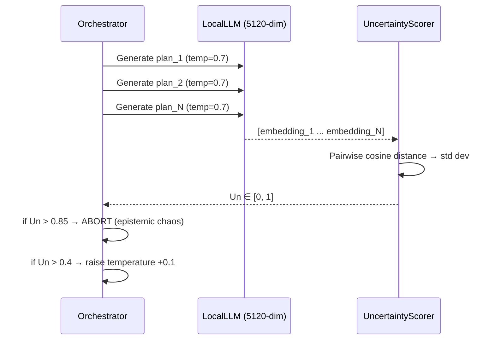
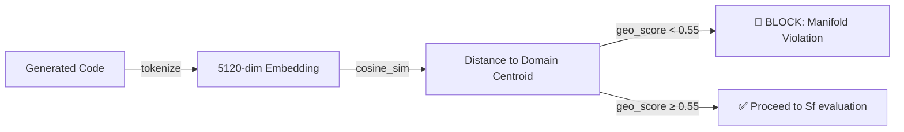
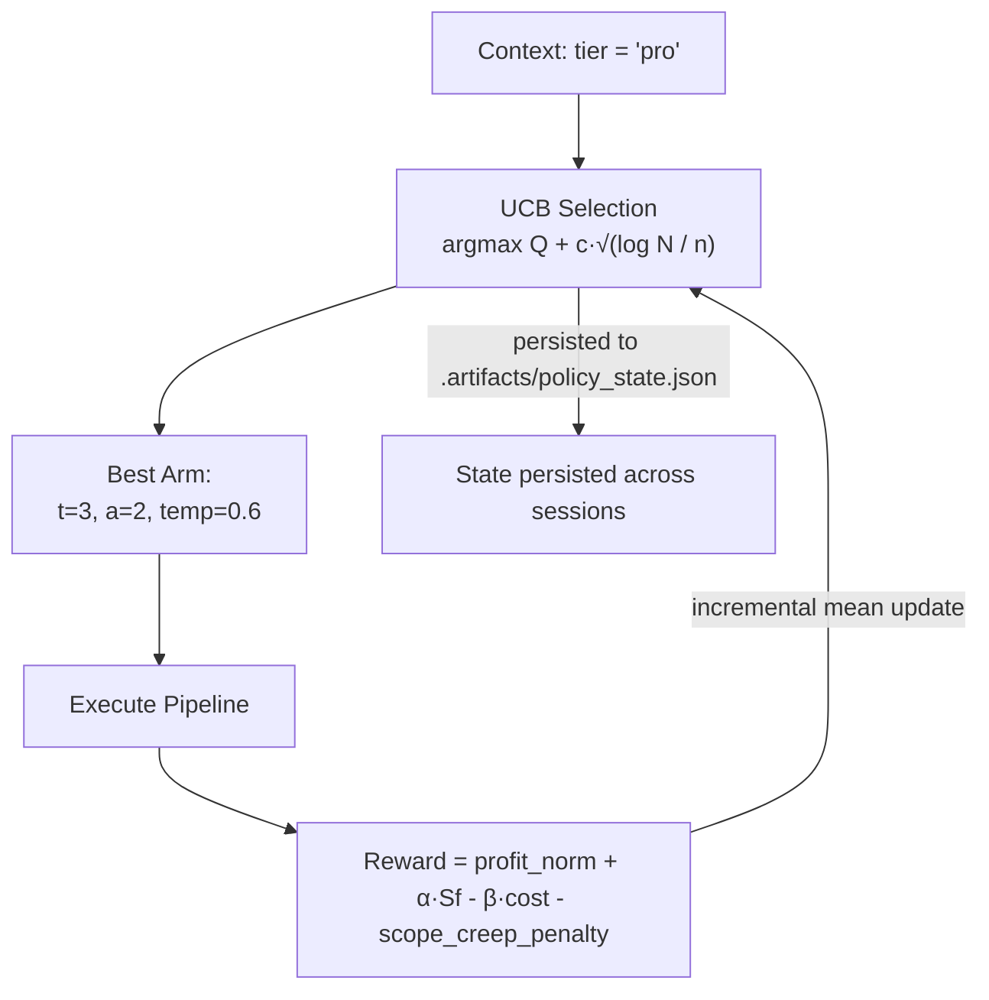
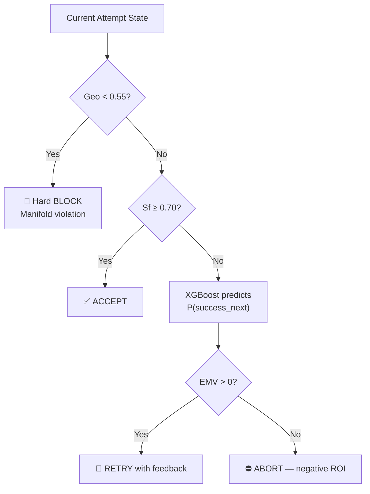
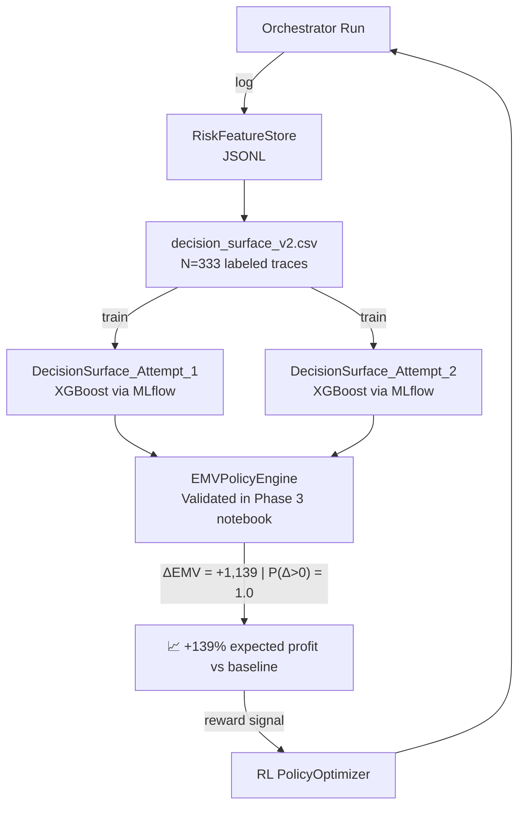

# PocketSales Agent — Technical Pitch
### AI Engineer Portfolio | Autonomous Production-Grade LLM System

---

## 1. Executive Summary

**PocketSales Agent** is a fully autonomous, self-correcting AI coding agent built from scratch in Python. It deploys a locally fine-tuned LLM (Qwen 2.5 32B, 4-bit quantized, 5120-dim embeddings) and orchestrates it through a multi-layer production system featuring epistemic uncertainty measurement, geometric manifold guards, XGBoost-based hallucination detection, a Reinforcement Learning policy optimizer (UCB bandits), and an EMV (Expected Marginal Value) economic decision engine.

> Every component was designed, built, and validated under **real production constraints**: GPU memory budgets, Docker CI/CD pipelines, cost-per-token accounting, and MLflow experiment tracking.

---

## 2. System Architecture

---

## 3. Core Methodology by Component

### 3.1 Epistemic Uncertainty (Un) — Self-Consistency Introspection

Before any code is generated, the system samples `N` independent reasoning plans from the LLM and measures their semantic divergence via cosine distance in embedding space.

### 3.2 Fisher Stability Score (Sf)

A composite quality signal that governs every retry/accept decision:

$$Sf = w_{un} \cdot (1 - Un) + w_{vn} \cdot (1 - Vn) + w_{cn} \cdot Cn$$

| Signal | Source | Meaning |
|--------|--------|---------|
| **Un** | Self-consistency sampling | Epistemic uncertainty of the plan |
| **Vn** | Shadow executor variance | Structural volatility of the output |
| **Cn** | LLM-as-Judge evaluation | Semantic correctness score |
| **Sf** | Weighted composite | System-level quality gate |

Thresholds are YAML-configurable and loaded at runtime from `config/fisher.yaml`.

### 3.3 Geometric Manifold Guard

Each LLM output is embedded into 5120-dimensional space (Qwen 2.5 last hidden state, mean-pooled). The cosine similarity to a domain centroid determines the **geometric coherence** of the solution.

### 3.4 XGBoost Risk Brain (Hallucination Detector)

A supervised XGBoost classifier trained on `datasets/risk/` with features `[geo_score, embedding_norm, temperature, tokens_used, retry_index, un_score]` predicts hallucination risk in real time. Model is stored as `models/production/risk_brain_bundle.pkl` and loaded by `RiskMonitor`.

### 3.5 RL Policy Optimizer — UCB Bandits

The action space `{thoughts} × {attempts} × {temperature}` has **48 arms** per tier. The policy learns which combinations yield the best economic outcome over time.

### 3.6 EMV Decision Engine — Economic Optimality

The retry-vs-abort decision is derived from the **Expected Marginal Value** equation, avoiding arbitrary threshold tuning:

$$EMV_{retry} = P(Success_{next}|Un, Geo, Vn) \cdot V_{task} - C_{retry} - (1 - P) \cdot C_{future\_loss}$$

`P(success_next)` is predicted by per-attempt XGBoost champion models registered in MLflow Model Registry, trained on `datasets/audit/decision_surface_v2.csv` (N=333 traces).

---

## 4. Production Engineering Stack

```mermaid
graph LR
    subgraph DEV["Development"]
        VS[VS Code + WSL2]
        GIT[Git + GitHub<br/>pre-push CI hook]
    end

    subgraph CI["CI Pipeline — ci_pipeline.sh"]
        RUFF[Ruff Linting]
        MYPY[MyPy Type Check]
        SEC[Secret Scanner<br/>ripgrep]
        TEST[pytest unit tests]
    end

    subgraph INFRA["Infrastructure"]
        DOCKER[Docker Compose<br/>agent + ollama + qdrant]
        QDRANT[Qdrant<br/>RAG Vector Store]
        MLFLOW[MLflow<br/>Experiment Tracking<br/>Model Registry]
        OLLAMA[Ollama<br/>Local LLM Serving]
    end

    subgraph MONITORING["Observability"]
        CSV[live_stability_log.csv<br/>Continuous Telemetry]
        JSONL[blocked_cases.jsonl<br/>Active Learning Data]
        FEAT[RiskFeatureStore<br/>Online Feature Pipeline]
    end

    GIT -->|triggers| CI
    CI -->|deploys| INFRA
    INFRA --> MONITORING
```

| Technology | Role |
|---|---|
| **Python 3.12** | Core agent runtime |
| **FastAPI** | Customer-facing API |
| **Unsloth + QLoRA** | Fine-tuning & inference (4-bit, cuda:0) |
| **XGBoost** | Risk Brain classifier |
| **Qdrant** | Vector similarity search (RAG) |
| **MLflow** | Experiment tracking + Model Registry |
| **Docker Compose** | Containerized multi-service orchestration |
| **pytest + ruff + mypy** | CI/CD quality gates |

---

## 5. Data Pipeline & Self-Improvement Loop

**Phase 3 Validation Results** (N=47 test runs, 3,000 bootstrap iterations):

| Metric | Value |
|---|---|
| Mean Policy Reward | 1,956.99 |
| Mean Baseline Reward | 817.86 |
| **ΔEMV (gain)** | **+1,139.14** |
| 95% Confidence Interval | [744.97, 1,530.20] |
| P(Δ > 0) | **1.0 (100%)** |
| VaR 5% | 798.21 |
| CVaR 5% | 710.04 |

---

## 6. Relevance to the Role

| Job Requirement | What I built |
|---|---|
| **LLM APIs & production agents** | Full autonomous agent with multi-step planning, retry logic, tool calling, and guardrails |
| **Python backend services** | FastAPI endpoint + async Orchestrator with latency/cost tracking (`ct_normalized`, `efficiency_score`) |
| **RAG & retrieval systems** | Qdrant-backed semantic memory initialized via `refresh_memory.py` |
| **ML model training & evaluation** | SFT fine-tuning (QLoRA), XGBoost training pipeline, MLflow experiment tracking |
| **Observability & monitoring** | `StabilityLogger` (CSV + JSONL), `RiskFeatureStore`, per-run `ExecutionTrace` |
| **CI/CD & containerization** | Docker Compose, pre-push hooks, ruff/mypy/pytest pipeline |
| **Decision-support systems** | EMV economic engine — exactly what finance/estate planning workflows need |
| **Cost optimization** | Per-token profit accounting, early-stop rules, RL budget control |

---

## 7. Closing Statement

This project represents **~3 months of architectural iteration** across 12+ development phases, going from a basic LLM wrapper to a production-grade autonomous agent with:

- Economic decision theory (EMV, UCB bandits)
- Rigorous statistical validation (bootstrap CIs, VaR/CVaR)
- Container-based CI/CD
- Self-improving data flywheel

The exact same principles — **reliable, cost-aware, observable AI systems operating in high-stakes domains** — directly map to building trustworthy LLM-powered systems for finance and estate planning clients.

---

*Repository: `MasterJavis/pocketsales-agent` (private) — available for technical deep-dive on request.*
