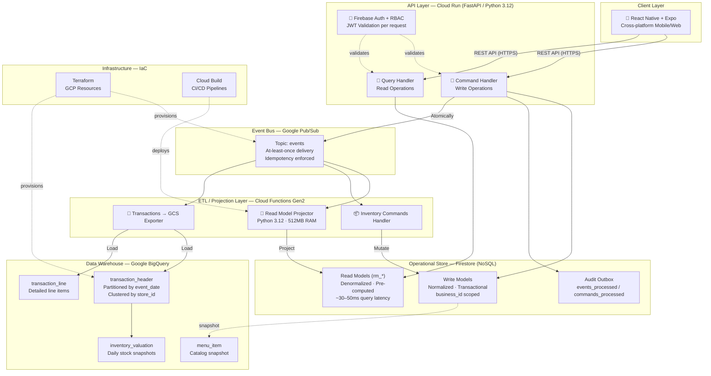
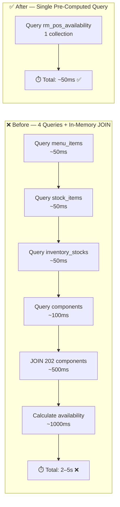
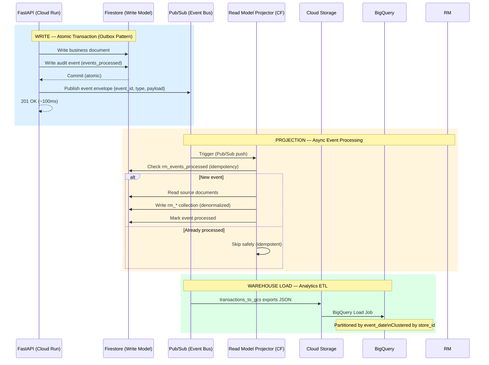
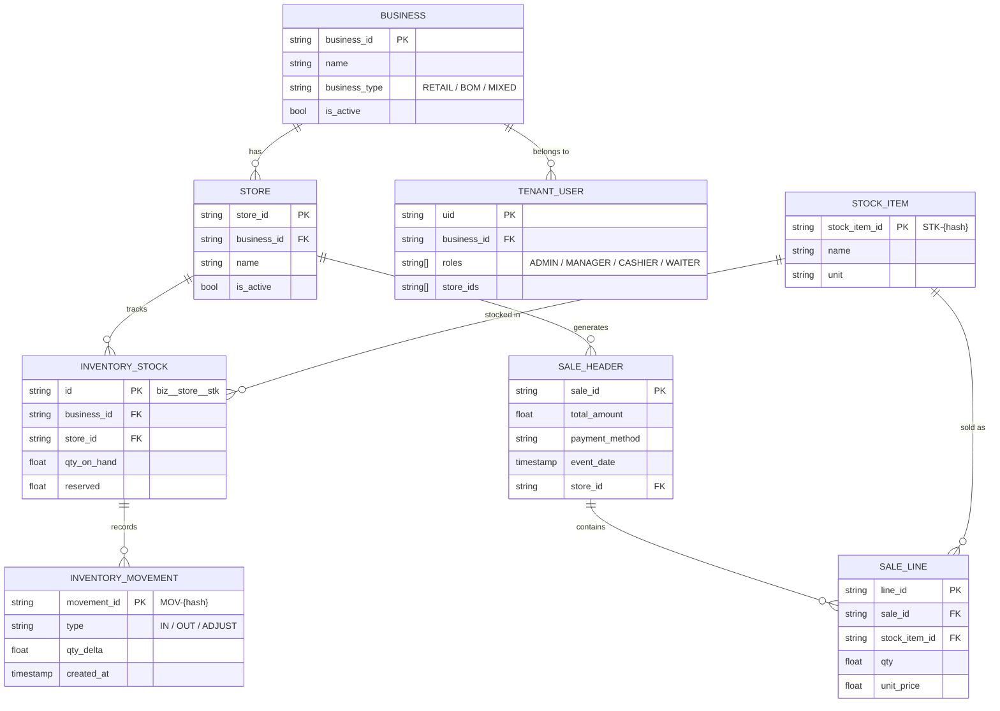
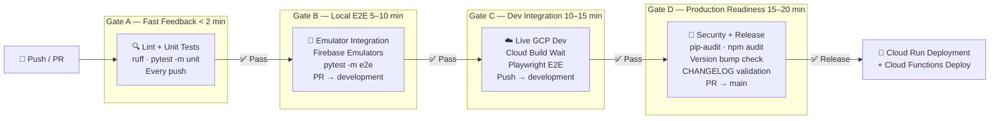
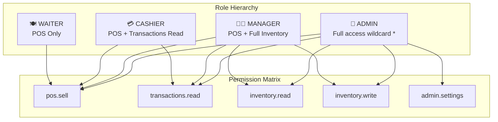
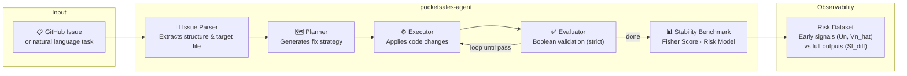
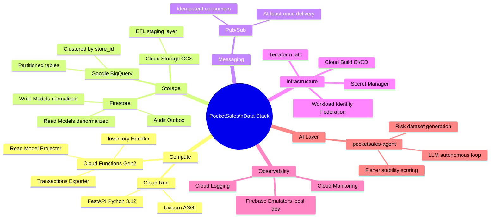

# 🚀 PocketSales — Technical Pitch
## Senior Data Engineer | Fintech | Cloud-Native Data Platform

> **Javier López Ramírez** · Backend & Data Engineer · GCP Specialist  
> *Building production-grade data infrastructure from scratch*

---

## 📌 The Problem I Solved

Food & beverage businesses needed a **real-time sales + inventory platform** capable of:
- Tracking stock levels across multiple stores with **zero negative inventory**
- Answering *"what can I sell right now?"* in **< 100ms**
- Projecting all operational data into a **analytics warehouse** (BigQuery) with full audit trail
- Running on a tight budget → **serverless, pay-per-use architecture** on GCP

---

## 🏗️ High-Level System Architecture

---

## 📊 CQRS + Read Model Pattern: The Data Engineering Core

The most critical design decision was separating **Write Models** (normalized, ACID-safe) from **Read Models** (denormalized, query-optimized).

### Before vs. After

> **Result: 40–100x latency reduction** on the most critical endpoint (`GET /pos/availability`)

---

## 🔄 ETL Pipeline: From Events to Data Warehouse

This is the core **data engineering pipeline** I designed and implemented end-to-end.

---

## 🗄️ Data Model: Multi-Tenant Hierarchy

> **Key constraint**: All queries are **scoped by `business_id` + `store_id`**. Tenant data isolation is enforced at the service layer and at Firestore rules level. Cross-tenant data leakage is classified as a **Sev-0 incident**.

---

## ⚙️ Read Models Inventory (Active Projections)

| Read Model | Docs | Latency | Source Events |
|---|---|---|---|
| `rm_pos_availability` | 54 | ~50ms | `inventory_movement.*` |
| `rm_inventory_items` | 41 | ~30ms | `stock_item.*`, `inventory_movement.*` |
| `rm_menu_item_bom` | 202 | ~40ms | `menu_item_components.*` |
| `rm_bom_index` | 202 | ~40ms | `menu_item_components.*` |
| `rm_tx_headers` | N | ~30ms | `inventory.checkout_completed` |
| `rm_tx_lines` | N | ~30ms | `inventory.checkout_completed` |

---

## 🚰 CI/CD Pipeline: 4-Gate Quality Gate

Designed a **4-gate progressive validation pipeline** to ensure code quality, test coverage, and production readiness before every deployment.

**Security**: CI/CD uses **Workload Identity Federation (WIF)** — zero long-lived secrets. GitHub Actions authenticates to GCP via OIDC token.

---

## 🔐 RBAC Security Model

Enforcement is **dual-layer**:
- **Backend**: `require_roles(user, ["MANAGER", "ADMIN"])` on every FastAPI endpoint
- **Frontend**: `can("inventory.write")` gates UI components in React Native

---

## 🤖 AI Engineering Layer — PocketSales Agent

On top of the data platform, I built **pocketsales-agent**: an autonomous LLM-powered engineering assistant that operates on the codebase itself.

- Uses **Fisher Information** to measure solution stability across temperature regimes
- Builds a **contrastive risk dataset** (Phase 10) to train a predictive risk model
- Strict **contract alignment** validation prevents prompt drift (ADR-001)

---

## 🎯 Mapping to the Job Requirements

| Requirement | What I Built |
|---|---|
| **Scalable data pipelines & ETL** | 3 Cloud Functions: Read Model Projector, Inventory Commands Handler, Transactions → GCS → BigQuery ETL |
| **Data models for analytics** | BigQuery: `transaction_header` (partitioned + clustered), `transaction_line`, `menu_item`, `inventory_valuation` |
| **Data quality & idempotency** | `rm_events_processed` collection — every event idempotent via `event_id`; Outbox pattern for dual-write safety |
| **Data governance** | Full audit trail via Outbox; RBAC enforced at API + Firestore rules; soft-delete only |
| **Python / SQL** | FastAPI backend in Python 3.12; BigQuery SQL (partitioned, clustered); Pydantic schemas |
| **Cloud (GCP)** | Cloud Run · Firestore · Pub/Sub · Cloud Functions Gen2 · BigQuery · Cloud Build · Secret Manager |
| **CI/CD** | 4-gate GitHub Actions pipeline with Workload Identity Federation |
| **Data warehousing & ETL best practices** | CQRS pattern, event-driven projections, pre-computed read models, 40–100x query improvement |
| **IaC** | Terraform for GCP resource provisioning; Cloud Build YAML pipelines per environment |
| **Git discipline** | Feature branches → `development` → `main`; gated PRs; conventional commits; version bumps enforced |

---

## 📈 Measured Outcomes

| Metric | Before | After |
|---|---|---|
| POS availability query latency | 2–5 seconds | **~50ms** (40–100x improvement) |
| Query count per `/pos/availability` | 4 queries + in-memory JOIN | **1 query** |
| CPU load on API tier | High (compute-intensive JOIN) | **Near zero** (read-only) |
| Scale behavior | Degrades as data grows | **Constant latency** (async projection) |
| Audit coverage | None | **100%** of mutations via Outbox |
| Test gates before production | None | **4 progressive gates** |

---

## 🛠️ Full Technology Stack

---

## 🔗 Project Repository

**GitHub**: `MasterJavis/android-sales`  
**Version**: `1.6.0` (production-ready)  
**Docs**: 27+ technical documents covering architecture, security, testing, deployment, and data contracts.

---

*Document generated: February 2026*
