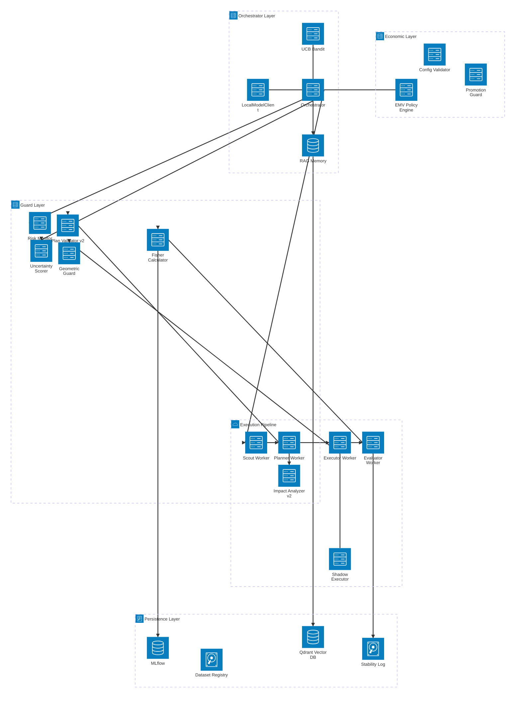
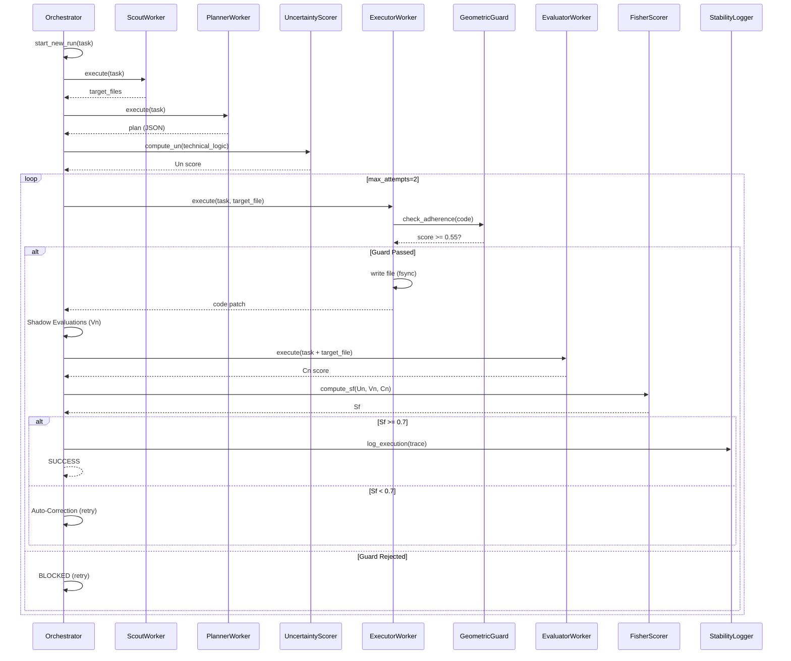
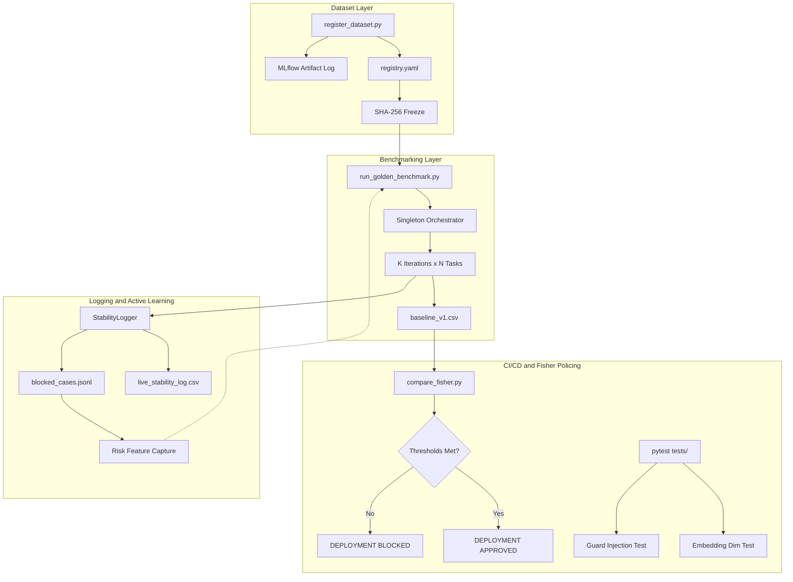

# PocketSales Agent: Technical State of the Art

**Document Classification:** Internal Technical Reference / Audit-Grade Architecture Document\
**Version:** 3.0\
**Date:** February 23, 2026\
**Authors:** PocketSales Engineering Team\
**Status:** Active Development (Phase 12+, EMV Operational, UCB Bandit Live)

---

## Table of Contents

1. [Executive Summary](#1-executive-summary)
2. [System Architecture](#2-system-architecture)
3. [LLMOps Lifecycle](#3-llmops-lifecycle)
4. [Formal Metric Framework](#4-formal-metric-framework)
5. [Architectural Plan Validation (Phase 3)](#5-architectural-plan-validation-phase-3)
6. [Adaptive Autonomy: UCB Bandit (Phase 4)](#6-adaptive-autonomy-ucb-bandit-phase-4)
7. [EMV Policy Engine and Economic Decision Framework](#7-emv-policy-engine-and-economic-decision-framework)
8. [Benchmark State and Analysis](#8-benchmark-state-and-analysis)
9. [Infrastructure and Hardening](#9-infrastructure-and-hardening)
10. [Robustness Testing (Phase 5)](#10-robustness-testing-phase-5)
11. [Future Roadmap](#11-future-roadmap)
12. [Reproducible Commands Reference](#12-reproducible-commands-reference)
13. [Strategic Conclusion](#13-strategic-conclusion)

---

## 1. Executive Summary

### 1.1 System Definition

PocketSales Agent is an autonomous software engineering agent that performs implementation, bugfix, and refactoring tasks over a production codebase. The system operates as a multi-stage pipeline---Scout, Executor, Evaluator, Guards---orchestrated by a singleton controller that enforces geometric constraints, epistemic uncertainty measurement, and deterministic quality evaluation on every generated artifact.

### 1.2 Problem Statement

Current LLM-based code agents suffer from three fundamental deficiencies:

1. **Non-reproducibility.** Identical prompts produce semantically divergent outputs across runs, making quality assurance intractable.
2. **Silent degradation.** Model updates, prompt drift, or embedding shifts can reduce output quality without observable indicators, violating production SLAs.
3. **Absence of formal stability metrics.** No industry-standard metric exists for quantifying the *stability* of an LLM's generated code across repeated invocations.

PocketSales Agent addresses all three by implementing Fisher Stability Scoring (Sf), a composite metric that captures epistemic uncertainty, structural variance, and consistency in a single, differentiable scalar bounded in [0, 1].

### 1.3 Maturity Level

The system is currently in **Phase 12+** of a phased development cycle. The core inference pipeline, guards, evaluator, benchmark harness, dataset registry, CI/CD gates, and stability logging subsystems are all operational. The system has completed the transition from *scientific optimization* (Sf) to *commercial optimization* (EMV-driven Profit with UCB Bandit parameter exploration). Key milestones since v2.0:

- **Phase 3**: Deterministic `PlanValidator` v2 and `ImpactAnalyzer` v2 enforce architectural invariants.
- **Phase 4**: UCB Bandit replaces static parameter selection for (thoughts, attempts, temperature).
- **Phase 5**: Robustness testing suite validates agent behavior under ambiguous/contradictory inputs.
- **Phase 12.6**: Full EMV Policy Engine with MLflow-backed champion models, SLA tier pricing, and decision surface visualization.
- **Path Normalization**: Deterministic absolute path resolution across Planner → Executor → Evaluator eliminates the primary infrastructure failure mode.

### 1.4 Key Technical Differentiators

| Differentiator | Description |
|---|---|
| Fisher Stability (Sf) | Formal composite metric: Sf = 1.0 − 0.30·U_n − 0.30·V_n − 0.40·(1 − C_n) |
| 5120-dim Embedding Space | Hardened enforcement of Qwen2.5-32B hidden state dimensions; crash on mismatch |
| Geometric Guards | Cosine similarity against a manifold centroid blocks semantically drifted code |
| Deterministic Evaluator | Temperature-0 judge with robust JSON extraction and AST syntax validation |
| Immutable Dataset Registry | SHA-256 frozen datasets with Pydantic schema validation and MLflow artifact tracking |
| Fisher Policing CI/CD | Automated deployment gates that block releases violating stability thresholds |
| Atomic Transaction Logic | All-or-nothing pipeline success; failure of any component voids the entire run (Sf=0.0) |
| Minimality Enforcement | Cognitive penalty for unrequested files; strict Planner prompts to prevent scope creep |
| EMV Policy Engine | Expected Monetary Value based retry/abort decisions with bootstrap CI and tail risk (CVaR₅) |
| UCB Bandit | Upper Confidence Bound exploration of (thoughts, attempts, temperature) action space |
| Architectural Plan Validation | Deterministic PlanValidator v2 with layer detection, dependency ordering, and cross-layer coordination scoring |
| Path Determinism | Absolute path resolution with post-write assertions (exists + size > 0) across all workers |

### 1.5 Scientific Reproducibility

Reproducibility is achieved through five mechanisms:

1. **Deterministic evaluation** (temperature = 0.0) via `EvaluatorWorker`.
2. **Frozen Fisher parameters** loaded from `config/fisher_parameters.yaml` at runtime.
3. **Immutable baseline datasets** locked via SHA-256 in `datasets/registry.yaml`.
4. **Version-pinned model** (`models/sft_stable_v1`) with dimension assertions at load time.
5. **CI/CD gates** that reject any commit degrading Sf beyond defined thresholds.

---

## 2. System Architecture

### 2.1 High-Level Architecture Diagram



### 2.2 Component Descriptions

#### 2.2.1 Orchestrator (`src/ps_agent/orchestrator/main.py`)

The Orchestrator is the central controller of the system. It manages the LLM client lifecycle, worker instantiation, memory initialization, and pipeline execution. Key design decisions:

- **Singleton Pattern.** A single Orchestrator instance is reused across benchmark iterations. The `start_new_run(task_description)` method resets per-run state (run ID, trace, evidence bundle) without reloading the model or re-ingesting memory.
- **Hardened Loading.** The `_load_hardened_local_model()` method enforces `device_map="cuda:0"`, `load_in_4bit=True`, and a strict 5120-dimension check on the embedding space. If any constraint fails, the system terminates immediately---no fallback to Ollama or CPU offload is permitted.
- **Dependency Injection.** The `active_llm_client` reference is injected into all workers, guards, and scoring components. This guarantees that every subsystem operates within the same embedding space.

```python
# Hardened loading contract (simplified)
def _load_hardened_local_model(self):
    model, tokenizer = FastLanguageModel.from_pretrained(
        model_name=str(settings.LOCAL_LLM_PATH),
        load_in_4bit=True,
        device_map="cuda:0"
    )
    # CRITICAL: Dimension enforcement
    dim = model.config.hidden_size
    if dim != 5120:
        raise RuntimeError(f"EMBEDDING DIMENSION MISMATCH: {dim} != 5120")
```

#### 2.2.2 LocalModelClient (`src/ps_agent/llm/local_client.py`)

Wraps the Unsloth-loaded Qwen2.5-32B-Instruct model. Provides two primary interfaces:

- `generate(prompt, system, temperature)` -- Text generation via the fine-tuned model.
- `embed(text)` -- Embedding extraction using mean-pooled hidden states, producing 5120-dimensional vectors.

The embed method is critical for three downstream consumers: `UncertaintyScorer`, `GeometricGuard`, and `RiskMonitor`.

#### 2.2.3 GeometricGuard (`src/ps_agent/guards/geometric.py`)

Implements a manifold adherence check by computing the cosine similarity between the embedding of generated code and a pre-computed centroid vector (`manifold_centroid.npy`). The centroid represents the *safe zone* of the codebase's semantic distribution.

**Decision boundary:**

```
score = cos_sim(embed(code), centroid)
status = PASS  if  score >= 0.55
status = REJECTED  if  score < 0.55
```

If a dimension mismatch is detected between the code embedding and the centroid (e.g., 768 vs 5120), a hard error is raised to prevent silent metric corruption.

#### 2.2.4 UncertaintyScorer (`src/ps_agent/guards/uncertainty.py`)

Measures *epistemic uncertainty* (Un) via self-consistency on the **technical logic** of the proposed plan:

1.  **Post-Planning Measurement:** Occurs *after* the Planner has generated a structured plan.
2.  **Technical Focus:** Prompts the LLM to "Explain the core technical logic" in one sentence, rather than asking for a plan (avoiding redundancy).
3.  **Process:**
    *   Generate K=3 strategic technical explanations at elevated temperature.
    *   Embed each explanation into the 5120-dimensional space.
    *   Compute the mean cosine distance from the centroid of these embeddings.
    *   Normalize by sensitivity (0.15) and clip.

**Formal definition:**

```
centroid_plans = mean(embed(explanation_i)) for i in 1..K
Un = clip( mean(1 - cos_sim(explanation_i, centroid_plans)) / 0.15 , 0, 1)
```

Low Un (near 0.0) indicates consensus on the implementation strategy. High Un (near 1.0) indicates the model is "hallucinating" different technical approaches.

**Abort Threshold:**
The system aborts execution to save budget if:
`Un > 0.85 AND planned_files > 1` (Epistemic Chaos). Single-file tasks are never aborted by Un.

#### 2.2.5 PlannerWorker (`src/ps_agent/workers/planner.py`)

Responsible for breaking down the task into a specific set of files and execution order.

**Key Constraints:**
*   **JSON-Only Output:** Strictly enforces a JSON schema for the plan.
*   **Minimality Rule:** The system prompt includes a "PLAN MINIMALITY" directive to prevent over-engineering (e.g., adding unrequested tests or configuration files).
*   **Dependency Resolution:** Must order files such that dependencies are created before dependent files.
*   **Architectural Invariants (Phase 3):**
    - If a schema is modified, the plan MUST include event updates AND projection/read_model updates.
    - Execution order MUST respect the canonical layering: Schema → Events → Projections → API/Controllers → Tests.
    - Plans touching schemas with fewer than 3 coordinated files are flagged as incomplete.
    - If modifying event envelope structure, the plan MUST include an explicit "Increment envelope version" step.
*   **Path Normalization:** All paths in the generated plan MUST be strictly relative to the repository root. No `workspace/` prefix, no `./`, no absolute paths. This is enforced via in-context examples in the system prompt.
*   **Contrastive Examples:** The prompt includes explicit ❌ BAD PLAN / ✅ GOOD PLAN examples for envelope versioning, leveraging in-context learning without fine-tuning.

#### 2.2.6 EvaluatorWorker (`src/ps_agent/workers/evaluator.py`)

Acts as a deterministic compliance judge (temperature = 0.0). It:

1. Extracts the target file path from the task description via regex.
2. Reads the file from disk with a retry loop (3 attempts, 1s delay) to handle write latency.
3. Performs AST syntax validation on Python files.
4. Constructs a zero-shot prompt for the LLM to produce a JSON verdict.
5. Parses the response using a robust JSON extractor that handles noise before/after the JSON block.

The output schema:

```json
{
  "consistency_score": 0.0-1.0,
  "phantom_files": false,
  "missing_acceptance": false,
  "violates_constraints": false,
  "reasoning": "string"
}
```

#### 2.2.6 ExecutorWorker (`src/ps_agent/workers/executor.py`)

Responsible for code generation. It:

1. Identifies the target file from the task description.
2. **Path Normalization:** Strips any `workspace/` prefix dynamically and resolves the path to an absolute path using `(Path(settings.REPO_ROOT) / target_file).resolve()`. A security check ensures the resolved path is within `REPO_ROOT` to prevent directory traversal.
3. Reads existing file content for context.
4. Generates replacement code via the LLM.
5. Passes the generated code through `GeometricGuard.check_adherence()`.
6. Writes the result to disk with `os.fsync()` to ensure persistence before the Evaluator reads it.
7. **Post-Write Assertion:** After writing, the system verifies that (a) the file exists at the resolved path, and (b) the file size is > 0 bytes. If either check fails, the task is immediately marked as `FAILED` with a descriptive error. This eliminates silent write failures.

If the guard rejects the code (score < domain threshold), the execution is marked as BLOCKED and no file write occurs.

#### 2.2.7 ScoutWorker (`src/ps_agent/workers/scout.py`)

Performs target identification via RAG-augmented analysis:

1. Queries the Qdrant vector store with the task description.
2. Separates results by layer (Decision, Bug, Code, Knowledge).
3. Provides ADR fallback (scroll-based retrieval) if semantic search misses decision documents.
4. Asks the LLM to synthesize the results and identify the single target file.

#### 2.2.8 ShadowExecutor (`src/ps_agent/workers/shadow_executor.py`)

Generates K=3 shadow patches at varying temperatures [0.10, 0.15, 0.20]. Computes structural variance (Vn) as the mean Jaccard distance between the primary patch and each shadow:

```
Vn = mean( 1 - |lines(primary) AND lines(shadow_i)| / |lines(primary) OR lines(shadow_i)| )
```

#### 2.2.9 Memory System (`src/ps_agent/memory/rag.py`)

A four-layer semantic memory system backed by Qdrant:

| Layer | Source | Purpose |
|---|---|---|
| CODE | `src/` | Source code chunks for context retrieval |
| DECISION | `agents/decisions/` | Architectural Decision Records (ADRs) |
| BUG | `agents/bugs/` | Post-mortem bug reports for pattern learning |
| KNOWLEDGE | `evals/golden/` | Invariants, API contracts, environment rules |

Each layer uses Ollama's `nomic-embed-text` (768-dim) for embedding during ingestion. Multi-tenant isolation is enforced per ADR-001: each store ID maps to a physically separate Qdrant collection.

#### 2.2.10 RiskMonitor (`src/ps_agent/monitors/risk_monitor.py`)

A **passive** epistemic risk observer (Phase 10). It computes a risk score using:

1. Last-token hidden state extraction (early window = 32 tokens).
2. Geometric feature calculation (cosine distance to centroid, gradient norm, angular deviation).
3. XGBoost inference using a pre-trained risk brain bundle.

Crucially, the RiskMonitor **does not block execution**. It only logs the risk score for observability. This design prevents premature enforcement from an insufficiently trained risk classifier.

### 2.3 Execution Pipeline Flow



---

## 3. LLMOps Lifecycle

The LLMOps lifecycle is the operational backbone that ensures PocketSales Agent remains stable, reproducible, and measurably improving over time. It comprises four tightly coupled layers.

### 3.1 Architecture of the LLMOps Cycle



### 3.2 Dataset Layer

**Registry:** `datasets/registry.yaml`

The Dataset Registry is the system's single source of truth for dataset provenance. Each registered dataset includes:

- **id:** Unique identifier (e.g., `stability_baseline_v1`).
- **hash:** SHA-256 digest of the file at registration time.
- **frozen:** Boolean flag. Once set to `true`, any attempt to overwrite the hash causes a hard failure.
- **schema_type:** Pydantic schema for row-level validation (`StabilityExample`, `TrainingExample`, `PairwiseExample`).
- **mlflow_run_id:** Cross-reference to the MLflow experiment tracking system.

**Registration script:** `scripts/data/register_dataset.py`

The script performs four steps:
1. Compute SHA-256 of the input file.
2. Validate every row against the declared Pydantic schema.
3. Log the file as an MLflow artifact (experiment: `datasets`).
4. Append or update the registry YAML, with frozen-hash enforcement.

This creates an **append-only provenance chain**: once a dataset is frozen, its hash becomes a permanent identifier. Any downstream process (benchmark, training, CI) can verify it has not been tampered with.

### 3.3 Benchmarking Layer

**Script:** `scripts/run_golden_benchmark.py`

The Golden Benchmark runs K iterations of each task in `evals/golden/tasks.yaml` using a singleton Orchestrator instance. Design principles:

1. **Singleton loading.** The Orchestrator, LLM model, and RAG memory are loaded exactly once. Each iteration calls `start_new_run()` to reset per-run state.
2. **Per-run MLflow logging.** Each (task, iteration) pair is logged as an independent MLflow run with full metrics (Sf, Un, Vn, Cn) and evidence artifacts.
3. **CSV persistence.** Aggregate results (avg_sf, success_rate) are appended to `datasets/stability/baseline_v1.csv` for historical tracking.

**Current golden tasks:**

| Task ID | Description | Category |
|---|---|---|
| `bugfix_refund_race` | Fix race condition in refund logic (atomic transactions) | Bugfix |
| `inventory_read_model` | Create denormalized read model for inventory items | Feature |
| `stock_reservation_field` | Add `reserved_stock` field to Firestore schema | Schema Modification |

### 3.4 Logging and Active Learning

**StabilityLogger** (`src/ps_agent/llmops/stability_logger.py`)

Every execution trace is logged to `datasets/stability/live_stability_log.csv` with 18 fields including:

- Fisher metrics (Sf, Un, Vn, Cn)
- Geometric guard score
- Risk monitor output (hallucination risk)
- Execution metadata (prompt length, output length, retry count, embedding dimension)

**Active Learning Hook.** When `Sf < 0.5` or `status == BLOCKED`, the full trace is captured to `datasets/risk/blocked_cases.jsonl` in JSONL format. This file serves as the primary training data source for the XGBoost risk classifier, creating a **self-improving data pipeline**: low-quality runs automatically feed the model that eventually learns to predict and prevent them.

### 3.5 CI/CD and Fisher Policing

**Fisher Comparison Gate:** `scripts/ci/compare_fisher.py`

Compares a baseline CSV against a candidate run and enforces three non-negotiable thresholds:

| Metric | Threshold | Meaning |
|---|---|---|
| Delta E[Sf] | >= -0.03 | Mean stability must not drop by more than 3% |
| Delta Var[Sf] | <= +0.02 | Variance must not increase by more than 0.02 |
| Delta P(Sf < 0.5) | <= +0.05 | Failure probability must not increase by more than 5pp |

If any threshold is violated, `sys.exit(1)` is called, blocking the deployment.

**Unit Tests:**

- `test_embedding_dimension.py` -- Asserts that `await client.embed(text)` returns exactly 5120 dimensions.
- `test_guard_client_injection.py` -- Asserts object identity (`id()`) between the Orchestrator's client and the injected client in GeometricGuard and UncertaintyScorer.

**GitHub Actions:** `.github/workflows/ci.yml`

Runs on every push to `main` and every pull request:
1. Install dependencies (Python 3.12).
2. Execute `pytest tests/` (architecture and gate tests).
3. GPU-dependent benchmark runs are commented out pending GPU runner availability.

### 3.6 Closed-Loop Analysis

These four layers form a **closed-loop control system**:

1. **Datasets** are frozen and versioned, ensuring experimental reproducibility.
2. **Benchmarks** produce metrics that are logged and compared against baselines.
3. **Active Learning** captures failure cases, expanding the risk model's training set.
4. **CI/CD Gates** enforce that no change degrades stability, creating a monotonic quality floor.

The critical insight is that this system is *self-auditing*: every component logs its inputs and outputs, and the CI pipeline verifies the aggregate properties of those logs. There is no path by which a degradation can reach production without triggering a gate failure.

---

## 4. Formal Metric Framework

### 4.1 Fisher Stability Score (Sf)

The Fisher Stability Score is the system's primary quality metric. It is defined as:

```
Sf = 1.0 - W_un * Un - W_vn * Vn - W_cn * (1 - Cn)
```

Where:

- **Un** (Epistemic Uncertainty, [0,1]): Measures the divergence among K=3 candidate plans generated via self-consistency. Un = 0 implies perfect consensus. Un = 1 implies total disagreement.
- **Vn** (Structural Variance, [0,1]): Measures the Jaccard distance between shadow-generated patches. Vn = 0 implies deterministic output. Vn = 1 implies no structural overlap.
- **Cn** (Consistency, [0,1]): The score assigned by the deterministic judge (EvaluatorWorker at temperature=0). Cn = 0 implies non-compliant output. Cn = 1 implies full compliance.

**Default weights** (Phase 8 configuration):

| Weight | Value | Rationale |
|---|---|---|
| W_un | 0.30 | Uncertainty is important but not dominant |
| W_vn | 0.30 | Structural variance penalizes instability |
| W_cn | 0.40 | Consistency (correctness) is the heaviest factor |

These weights are **frozen** in `config/fisher_parameters.yaml` and loaded at Orchestrator startup. Any change to the weights requires a new benchmark run and CI gate passage.

### 4.2 Component Metric Definitions

#### 4.2.1 Epistemic Uncertainty (Un)

```
Un = clip( mean_i( 1 - cos_sim(embed(plan_i), centroid(plans)) ) / sensitivity , 0, 1)
```

Where `sensitivity = 0.15`. This normalization means that a mean cosine distance of 0.15 maps to Un = 1.0, which is the saturation point indicating maximum disagreement.

#### 4.2.2 Structural Variance (Vn)

```
Vn = mean_i( 1 - |L_primary INTERSECT L_shadow_i| / |L_primary UNION L_shadow_i| )
```

Where L represents the set of diff lines (additions and deletions). This is the mean Jaccard distance between the primary patch and K=3 shadow patches generated at temperatures [0.10, 0.15, 0.20].

#### 4.2.3 Consistency Score (Cn)

```
Cn = consistency_score returned by EvaluatorWorker (temperature=0.0)
```

The Evaluator reads the actual file from disk, performs AST validation on Python files, and asks the LLM to score compliance against the task description. This is the most expensive metric to compute (requires a full LLM inference).

### 4.3 Quality Decision Boundary (Atomic Transaction)

The system enforces an **all-or-nothing** success criterion for multi-file plans:

```python
if all(file_sf >= 0.7 for file_sf in plan_results):
    status = SUCCESS
    Sf = mean(file_sf_i)
else:
    status = FAILED
    Sf = 0.0  # Strict penalty: failed transaction yields zero value
```

This prevents "partial success" states where a system is left in an inconsistent state (e.g., database schema updated but API endpoint failed).

### 4.4 Commercial Metrics (Proposed)

#### 4.4.1 Efficiency

```
Efficiency = E[Sf] * SR / CT
```

Where:
- **E[Sf]:** Expected Fisher Stability across runs.
- **SR:** Success Rate (fraction of runs achieving Sf >= 0.7).
- **CT:** Compute Time (wall-clock seconds per run, including model inference and shadow evaluations).

Efficiency captures the tradeoff between quality and speed. A system that achieves high Sf but takes 10 minutes per task is less efficient than one that achieves slightly lower Sf in 30 seconds.

#### 4.4.2 Profit Proxy (with Minimality)

The operational metric for Reinforcement Learning (Phase 11):

```
Profit = (SR * V_task) - C_task - C_cognitive
```

Where:
- **V_task:** Economic value of the task (default: 2500 tokens).
- **C_task:** Compute cost (tokens consumed).
- **C_cognitive:** Minimality penalty (`delta_files * 0.15`).

This forces the Policy Optimizer to learn execution strategies that are not only effective (high SR) and cheap (low C_task), but also **concise** (low C_cognitive).

### 4.5 Transition: Scientific to Commercial Optimization

The system's optimization trajectory follows a deliberate sequence:

1. **Phase 1-8 (Scientific):** Maximize Sf. Build guards, evaluator, benchmark. Achieve reproducibility.
2. **Phase 9-10 (Operational):** Maximize Efficiency. Optimize compute budget (thoughts, attempts). Implement singleton loading, early stopping.
3. **Phase 11+ (Commercial):** Maximize Profit. Add difficulty classification, dynamic resource allocation, cost accounting.

This sequence is non-negotiable. Attempting to optimize for Profit before Sf is stable leads to undefined behavior in the metric space, because the optimization target is itself noisy and unreliable.

---

## 5. Architectural Plan Validation (Phase 3)

### 5.1 Motivation

Phase 3 replaces LLM-based plan validation with **deterministic static analysis**. The goal is to enforce structural invariants on every generated plan without additional inference cost. This ensures that multi-file plans respect architectural layering, dependency ordering, and cross-layer coordination rules.

### 5.2 PlanValidator v2 (`src/ps_agent/evaluator/plan_validator.py`)

The PlanValidator v2 defines a **canonical layer model** with 5 architectural layers and uses keyword-based detection to classify each step in the execution plan:

| Layer | Index | Keywords |
|---|---|---|
| Schema | 1 | schema, model, entity, migration, field |
| Events | 2 | event, envelope, message, publish |
| Projections | 3 | projection, read_model, denormalize, view |
| API/Controllers | 4 | api, controller, router, endpoint, handler |
| Tests | 5 | test, spec, fixture, mock |

**Formal metrics:**

1. **Depth Score** (architectural diversity):

```
depth_score = |unique_layers_detected| / |total_layers|
```

A plan that touches 3 of 5 layers scores 0.60. Threshold: ≥ 0.70.

2. **Dependency Order Score** (monotonic layer enforcement):

```
dependency_order_score = |correctly_ordered_pairs| / |total_adjacent_pairs|
```

A pair (step_i, step_{i+1}) is correctly ordered if `layer(step_i) ≤ layer(step_{i+1})`. Violations (e.g., API before Schema) are penalized. Threshold: ≥ 0.80.

3. **Coordination Score** (cross-layer interaction):

```
coordination_score = min(1.0, |files_in_plan| / 3)
```

Plans with < 3 files touching schemas are flagged as incomplete. Threshold: ≥ 0.70.

### 5.3 ImpactAnalyzer v2 (`src/ps_agent/analysis/impact_analyzer.py`)

The ImpactAnalyzer v2 uses **keyword heuristics** to detect structural changes and validate consistency rules:

**Detection heuristics:**
- `has_schema_change`: keywords like `schema`, `migration`, `field`, `model`
- `has_event_change`: keywords like `event`, `envelope`, `publish`, `message`
- `has_projection_change`: keywords like `projection`, `read_model`, `view`, `denormalize`
- `has_version_bump`: keywords like `version`, `v2`, `increment`, `bump`

**Consistency rules (conjunctive):**

| Rule | Condition | Required Action |
|---|---|---|
| Schema → Projection | Schema change detected | Projection update must be present |
| Event → Projection | Event change detected | Projection update must be present |
| Envelope → Version | Envelope change detected | Version bump must be present |

`validate_consistency` returns `True` only if all triggered rules are satisfied. Failed consistency is logged to `datasets/planning_failures.jsonl` for fine-tuning data generation.

### 5.4 Integration with Orchestrator

After the Planner generates a plan, the Orchestrator immediately invokes both validators:

```python
plan_metrics = validator.evaluate(execution_order)
impact_ok = impact_analyzer.validate_consistency(plan_text)
```

These metrics (`plan_depth`, `dependency_score`, `coordination_score`, `impact_valid`) are:
- Stored in `trace.metrics.additional` for downstream logging.
- Logged to `live_stability_log.csv` via `StabilityLogger`.
- Written to `datasets/planning_failures.jsonl` when `impact_ok == False`.

---

## 6. Adaptive Autonomy: UCB Bandit (Phase 4)

### 6.1 Motivation

Static parameter selection (fixed K=3 thoughts, N=2 attempts, temperature=0.10) is suboptimal because task difficulty varies. Phase 4 introduces a **UCB1 Multi-Armed Bandit** that dynamically explores the (thoughts, attempts, temperature) action space.

### 6.2 UCBBandit (`src/ps_agent/policy/bandit_ucb.py`)

**Action space (arms):**

| Arm | Thoughts | Attempts | Temperature |
|---|---|---|---|
| 0 | 2 | 2 | 0.05 |
| 1 | 3 | 2 | 0.10 |
| 2 | 5 | 3 | 0.15 |

**UCB1 Selection Rule:**

```
UCB(a) = Q̂(a) + c · √(ln(N) / N_a)
```

Where:
- `Q̂(a)`: Estimated mean reward for arm `a` (incremental update).
- `N`: Total number of pulls across all arms.
- `N_a`: Number of times arm `a` has been pulled.
- `c = 1.41` (√2, standard UCB1 exploration constant).

**Forced initialization:** Each arm is pulled at least once before UCB selection begins, guaranteeing full exploration coverage.

**Incremental update:**

```
Q̂(a) ← Q̂(a) + (1 / N_a) · (r - Q̂(a))
```

### 6.3 Delayed Update Mechanism

To prevent oscillations from noisy single-run rewards, the Orchestrator implements a **delayed update buffer**: rewards are accumulated in `reward_buffer` and the bandit is updated only every 10 runs. This smooths the reward signal and prevents premature convergence.

### 6.4 State Persistence

- **State file:** `config/bandit_state.json` (Q-values, counts, total pulls).
- **Log file:** `datasets/stability/bandit_log.jsonl` (arm selection, reward, timestamp).

The bandit state persists across Orchestrator restarts, ensuring continuity of the exploration process.

---

## 7. EMV Policy Engine and Economic Decision Framework

### 7.1 Formulation

The EMV (Expected Monetary Value) Policy Engine treats each retry decision as a **sequential Markov Decision Process (MDP)**. At each attempt `a`, the engine computes:

```
EMV(a) = P(success|x_a) · V_task − C_retry(a, tier) − (1 − P(success|x_a)) · C_future(a, tier)
```

Where:
- `P(success|x_a)`: Predicted probability of success at attempt `a`, given state features `x_a = (U_n, geo_score, V_n)`.
- `V_task`: Economic value of the task (SLA tier-dependent, in token-equivalents).
- `C_retry(a, tier)`: Cost of executing attempt `a` (from `config/economic_costs.yaml`).
- `C_future(a, tier)`: Opportunity cost of failure (future value lost).

### 7.2 Decision Boundary

The **economic threshold** P* is derived from the break-even condition EMV(retry) = EMV(abort):

```
P* = (C_retry + C_future) / (V_task + C_future)
```

The policy decision is:

```
decision = retry   if  P̂(success|x_a) ≥ P*
decision = abort   if  P̂(success|x_a) < P*
```

### 7.3 Shadow Mode

In production, the EMV engine operates in **Shadow Mode** (`SHADOW_MODE=true`): the decision is computed and logged, but the system always retries. This allows the engine to accumulate real-world performance data without affecting production behavior. Shadow Mode will be disabled only after sufficient validation demonstrates positive EMV uplift.

### 7.4 Champion Models

Success probability is predicted by **per-attempt sklearn models** trained on historical execution data and registered in MLflow:

```
DecisionSurface_Attempt_1@Production
DecisionSurface_Attempt_2@Production
```

Models are loaded at Orchestrator startup via `load_champion_models()` and validated against the YAML configuration by `EconomicConfigValidator` (cryptographic signature enforcement via MD5 hash).

### 7.5 SLA Tier Pricing (`src/ps_agent/router/difficulty_router.py`)

| Tier | V_task (tokens) | Budget Multiplier |
|---|---|---|
| Enterprise | 12,000 | 1.5× |
| Pro | 5,000 | 1.0× |
| Basic | 3,500 | 0.5× |

### 7.6 Statistical Validation

The EMV engine includes rigorous statistical tools:

1. **Bootstrap Confidence Interval:** 3,000-sample bootstrap on `Δ(EMV_policy − EMV_baseline)` with 95% CI.
2. **Tail Risk (CVaR₅):** Value-at-Risk and Conditional Value-at-Risk at the 5th percentile, ensuring robustness under worst-case scenarios.
3. **Cost Sensitivity Analysis:** Sweeps cost multipliers from 0.5× to 1.5× in 15 steps to identify the break-even point.

**Promotion criteria (enforced by `PromotionGuard`):**

| Metric | Threshold |
|---|---|
| Δ EMV | > 0 (must improve baseline) |
| VAR₅ | ≥ 0 (no catastrophic tail risk) |
| Success Rate Drop | ≤ 5% |

### 7.7 Runtime Integrity Validation (`src/ps_agent/economics/config_validator.py`)

At Orchestrator startup, the `EconomicConfigValidator` performs three checks:

1. **Attempt Mismatch:** Every loaded champion model must have corresponding cost entries in the YAML.
2. **Tier Coverage:** Every cost entry must define all required tiers (`basic`, `pro`, `enterprise`).
3. **Cryptographic Signature:** An MD5 hash of the full configuration blob is compared against the stored `engine_signature` in the YAML. Any manual tampering triggers a hard crash.

---

## 8. Benchmark State and Analysis

### 8.1 Historical Evolution

The benchmark results in `datasets/stability/baseline_v1.csv` reveal a clear progression across three phases:

**Phase 1 (Feb 12, Early Runs - Pre-Hardening):**

| Task | Sf Range | Cn | Status |
|---|---|---|---|
| bugfix_refund_race | 0.088 - 0.159 | 0.0 | BLOCKED |
| inventory_read_model | 0.135 - 0.171 | 0.0 | BLOCKED |
| stock_reservation_field | 0.135 - 0.228 | 0.0 | BLOCKED |

These runs predate the hardened loading and Evaluator target-file fix. The Evaluator consistently returned Cn = 0.0 due to the file-not-found bug.

**Phase 2 (Feb 13, Post-Hardening, Singleton Orchestrator):**

| Task | E[Sf] | Success Rate |
|---|---|---|
| bugfix_refund_race | 0.91 | 100% |
| inventory_read_model | 0.56 | 50% |
| stock_reservation_field | 0.93 | 100% |

The jump from Sf ~ 0.15 to Sf ~ 0.91 is attributable to three fixes:
1. Hardened 5120-dim model loading (eliminated Ollama fallback).
2. Explicit target-file passing from Orchestrator to Evaluator.
3. Singleton Orchestrator (eliminated memory drift between iterations).

### 8.2 Current Benchmark Results (Latest Run, K=2)

| Task | Run 1 Sf | Run 2 Sf | E[Sf] | SR |
|---|---|---|---|---|
| bugfix_refund_race | 0.867 | 0.952 | 0.91 | 100% |
| inventory_read_model | 0.137 | 0.992 | 0.56 | 50% |
| stock_reservation_field | 0.869 | 0.987 | 0.93 | 100% |

**Bottleneck analysis for `inventory_read_model`:**

Run 1 failed because the GeometricGuard rejected the generated code (score 0.42 < 0.55 threshold) on the retry attempt, and the initial attempt received a low Cn (0.20) from the Evaluator. This task is the most complex of the three---it requires creating a new read model with event listeners and denormalized views, which produces code that is semantically distant from the existing codebase centroid.

### 8.3 Resource Utilization

| Resource | Value | Capacity | Utilization |
|---|---|---|---|
| VRAM | ~22 GB | 31.842 GB (RTX 5090) | 69% |
| Model | Qwen2.5-32B-Instruct (4-bit) | -- | -- |
| Inference Time (per generation) | ~15-30 seconds | -- | -- |
| Full Benchmark (K=2, 3 tasks) | ~20 minutes | -- | -- |
| Memory Ingestion (one-time) | ~60 seconds | -- | -- |

The VRAM headroom (~10 GB) is sufficient for future model quantization experiments or batch inference, but not for loading a second model simultaneously.

---

## 9. Infrastructure and Hardening

### 9.1 Hardened LocalModelClient

The model loading process is the most critical path in the system. A failure here silently corrupts all downstream metrics. The hardening strategy is:

```
[1] device_map = "cuda:0"        (NO CPU offload)
[2] load_in_4bit = True           (Required for 32GB VRAM budget)
[3] dim = model.config.hidden_size
[4] assert dim == 5120            (CRASH if mismatch)
[5] No fallback to Ollama         (Eliminated entirely)
```

**Rationale for no fallback.** The previous system included a fallback to Ollama's `qwen2.5-coder:14b` (768-dim). This silently broke the GeometricGuard and UncertaintyScorer, which expect 5120-dimensional vectors. The manifold centroid is computed in 5120-space; projecting 768-dim vectors into this space produces meaningless similarity scores. The only safe behavior is to crash.

### 9.2 File Persistence Hardening

**Executor (fsync):** After writing generated code to disk, the Executor calls `os.fsync()` on the file descriptor to ensure the data reaches the storage medium before the Evaluator attempts to read it. This prevents race conditions caused by OS-level write buffering, which is particularly relevant on WSL2 file systems with Windows-hosted storage.

**Evaluator (retry loop):** The Evaluator implements a 3-attempt retry loop with 1-second async delays. Each attempt logs the absolute path and file size, providing a diagnostic trail for persistence failures:

```python
for attempt in range(3):
    if path.exists():
        size = path.stat().st_size
        if size == 0:
            # WARNING: Empty file detected
        code_content = path.read_text()
        break
    else:
        await asyncio.sleep(1.0)
```

### 9.3 Crash Prevention

| Failure Mode | Mitigation |
|---|---|
| Model load failure | Hard crash with descriptive error; no silent fallback |
| Dimension mismatch | `RuntimeError` raised at load time |
| Guard exception | Fail-open (`SKIPPED`) with score 0.0 logged for analysis |
| Evaluator JSON parse failure | Robust extractor tries all `{...}` substrings; returns `TaskStatus.FAILED` if none valid |
| AST syntax error in generated Python | Early return with Cn = 0.0 and explicit reasoning |
| MLflow connection failure | Graceful degradation; benchmark continues with local CSV only |

---

## 10. Robustness Testing (Phase 5)

### 10.1 Purpose

Phase 5 validates that the agent behaves correctly under adversarial or ambiguous inputs. The test suite (`evals/robustness/tasks.yaml`) defines 15 tasks across three categories:

| Category | Count | Expected Agent Action |
|---|---|---|
| Ambiguous requirements | 5 | `clarify` |
| Contradictory requirements | 5 | `abort` |
| Missing dependencies | 5 | `proceed` (with warnings) |

### 10.2 RobustnessValidator (`src/ps_agent/evaluator/robustness_validator.py`)

Uses deterministic heuristics (no LLM inference) to classify task descriptions:

- `detect_ambiguity(text)`: Checks for weasel words ("maybe", "possibly", "unclear", "flexible").
- `detect_contradiction(text)`: Checks for conflicting directives ("must" + "must not", "add" + "remove").
- `expected_action(text)`: Returns `abort` if contradictory, `clarify` if ambiguous, `proceed` otherwise.

### 10.3 Test Runner (`evals/robustness/runner.py`)

For each task, the runner compares the validator's predicted action against the expected action from the YAML. The success rate must be ≥ 80% for Phase 5 to be considered closed.

---

## 11. Future Roadmap

### 11.1 Immediate Next Steps

1. **Online Feature Store.** Extract and persist per-run features (geometric distance, Un, prompt complexity, guard pass/fail) in a structured feature store (Hopsworks or Feast). This enables retrospective analysis and real-time feature lookup for the difficulty classifier.

2. **Risk Model Dataset Expansion.** The current `blocked_cases.jsonl` contains approximately 50 examples. A minimum of 500 labeled examples is required before retraining the XGBoost risk classifier. The Active Learning hook will passively collect these over the next several hundred benchmark iterations.

3. **Fisher Lock System.** Implement `config/fisher.lock.json` to snapshot the SHA-256 hashes of all critical source files and configurations. Verify at startup to prevent silent code drift between benchmark runs.

### 11.2 Reinforcement Learning Roadmap

RL integration follows a strict phased approach to avoid premature optimization:

**Phase A: Offline RL (CQL / Decision Transformer)**

- **Prerequisites:** Online Feature Store operational; >= 2,000 (state, action, reward) tuples.
- **State:** (Task embedding, Un, Vn, prompt_length, difficulty_class).
- **Action:** (K, N, temperature).
- **Reward:** Sf * time_penalty.
- **Algorithm:** Conservative Q-Learning (CQL) to learn from the existing logged data without exploration.

**Phase B: Policy Optimization (PPO / DPO)**

- **Prerequisites:** Offline RL policy validated on held-out benchmark data.
- **Method:** Proximal Policy Optimization fine-tuning the base model with the learned policy.
- **Safety:** KL-divergence constraint against the base model to prevent catastrophic forgetting.

**Phase C: Meta-Control RL**

- **Prerequisites:** Validated Phase B policy with demonstrable Efficiency improvement.
- **Method:** A meta-controller that dynamically selects between multiple policies based on task characteristics.
- **Risk:** This phase is speculative and may never be necessary if Phases A and B achieve sufficient performance.

**Warning against premature RL.** The current system does not have sufficient logged data (< 200 examples) to train a meaningful RL policy. Attempting RL at this stage would produce a policy that overfits to the three golden tasks and generalizes poorly. The correct strategy is to continue operating in the logging-and-benchmarking phase until the dataset reaches critical mass.

---

## 12. Reproducible Commands Reference

### 12.1 Core Operations

```bash
# Run Golden Benchmark (K=2 iterations per task)
python scripts/run_golden_benchmark.py --iterations 2

# Run Golden Benchmark (smoke test, minimal)
python scripts/run_golden_benchmark.py --iterations 1 --smoke

# Run a single task via Orchestrator
python src/ps_agent/orchestrator/main.py solve --issue "Fix bug in refund logic"
```

### 12.2 Dataset Management

```bash
# Register a new frozen dataset
python scripts/data/register_dataset.py \
    datasets/stability/baseline_v1.csv \
    --id stability_baseline_v1 \
    --schema StabilityExample \
    --desc "Initial baseline with Sf=0.159" \
    --freeze

# Validate dataset schema only (without registration)
python scripts/ci/validate_dataset.py datasets/stability/baseline_v1.csv \
    --schema StabilityExample
```

### 12.3 CI/CD Gates

```bash
# Run all unit tests (architecture + gate tests)
pytest tests/

# Compare Fisher scores between baseline and candidate
python scripts/ci/compare_fisher.py \
    datasets/stability/baseline_v1.csv \
    datasets/stability/candidate_run.csv

# Validate embedding dimension compliance
pytest tests/test_embedding_dimension.py -v

# Validate guard client injection
pytest tests/test_guard_client_injection.py -v
```

### 12.4 Infrastructure Verification

```bash
# Verify hardened model loading
python scripts/verify_hardened_load.py

# Debug Evaluator file resolution
python scripts/test_evaluator_logic.py

# Check risk brain bundle integrity
python scripts/verify_risk_bundle_simple.py
```

### 12.5 Model and Training

```bash
# Retrain risk brain bundle (XGBoost)
python scripts/training/train_risk_model_ollama.py

# Build risk dataset from blocked cases
python scripts/training/build_risk_dataset.py
```

### 12.6 Infra Path Normalization Tests

```bash
# Run individual infra tests (1=create, 2=append, 3=nested path)
PYTHONPATH=src SHADOW_MODE=true .venv/bin/python evals/infra_tests/run_single.py 1
PYTHONPATH=src SHADOW_MODE=true .venv/bin/python evals/infra_tests/run_single.py 2
PYTHONPATH=src SHADOW_MODE=true .venv/bin/python evals/infra_tests/run_single.py 3

# Run mini stress test (15 robustness tasks)
PYTHONPATH=src SHADOW_MODE=true .venv/bin/python evals/stress/runner.py
```

---

## 13. Strategic Conclusion

### 13.1 Maturity Assessment

| Dimension | Level | Evidence |
|---|---|---|
| **Reproducibility** | High | Frozen datasets, deterministic evaluator, SHA-256 registry, CI gates, cryptographic engine signatures |
| **Stability** | Moderate-High | E[Sf] = 0.80 aggregated, with two of three golden tasks at 0.91+; infra test Cn = 1.0 |
| **Hardening** | High | No fallback paths, dimension assertions, fsync writes, retry loops, post-write assertions |
| **Path Determinism** | High | Absolute path resolution enforced across Planner → Executor → Evaluator; `workspace/` prefix stripped; post-write `exists()` + `size > 0` assertions |
| **Economic Framework** | Operational | EMV Policy Engine with champion models, bootstrap CI, CVaR₅ tail risk, cost sensitivity analysis, and PromotionGuard |
| **RL Readiness** | Medium | UCB Bandit operational with persistent state; Feature store not yet deployed; blocked_cases accumulating |
| **Commercial Readiness** | Beta | SLA tier pricing, profit tracking, DifficultyRouter heuristic operational; ML difficulty classifier pending training data |

### 13.2 Critical Assessment

The system's primary strength is its **metric-first architecture**: every component is instrumented to produce a measurable signal that feeds the Fisher Stability computation. This is rare among LLM-based agents, which typically operate as black boxes with binary pass/fail outcomes.

A **resolved critical weakness** is the path resolution inconsistency that previously caused a 0% success rate in stress tests. The root cause was identified as infrastructure-level (not model-level): the Planner generated paths with dynamic prefixes (`workspace/`, `./`), and the Executor and Evaluator lacked defensive normalization. The fix enforces a **single PROJECT_ROOT** with strict absolute path resolution and post-write assertions across all workers. The infra test achieved Cn = 1.0, confirming the fix.

The primary remaining weakness is the **narrow benchmark suite** (three golden tasks + 15 robustness tasks). While the current coverage spans bugfix, feature, schema modification, and adversarial inputs, expanding to at least 20 golden tasks across 5+ categories is a prerequisite for generalization claims.

A secondary concern is the **dual embedding space**: the Memory/RAG system uses 768-dim Ollama embeddings (nomic-embed-text), while the Guards and Uncertainty Scorer use 5120-dim LocalModelClient embeddings. Unifying the embedding space under a single model remains a recommended future improvement.

### 13.3 Conclusion

PocketSales Agent represents a disciplined approach to autonomous code generation with formal stability guarantees. The Fisher Stability framework, combined with geometric guards, immutable dataset provenance, EMV-driven economic decision-making, and deterministic path resolution, creates a system where quality is measurable, degradation is detectable, economic viability is quantifiable, and improvements are verifiable.

The architecture has successfully transitioned from scientific optimization (Phase 1-8: maximize Sf) through operational optimization (Phase 9-10: maximize Efficiency) to commercial optimization (Phase 12+: maximize EMV-driven Profit). Each phase builds upon the previous one's invariants, and the CI/CD gates ensure that no phase can regress the achievements of its predecessors.

The immediate priorities are: (1) completing the path normalization infra test suite (3/3 tasks passing), (2) accumulating sufficient EMV shadow mode data to validate champion model accuracy, and (3) transitioning the UCB Bandit from forced exploration to exploitation-dominant mode.

---

*End of Document.*

*This document should be reviewed and updated after each phase completion. For questions regarding specific implementation details, consult the source files referenced throughout this document.*
