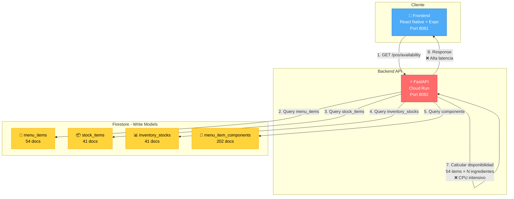
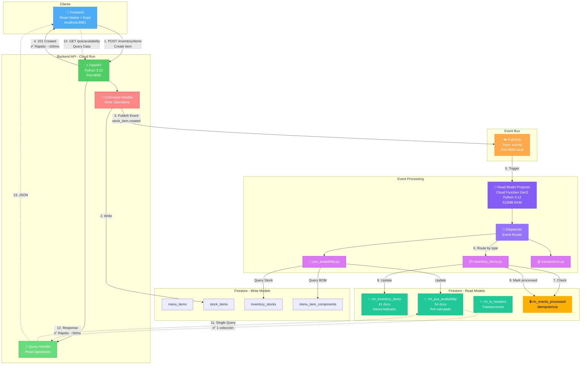
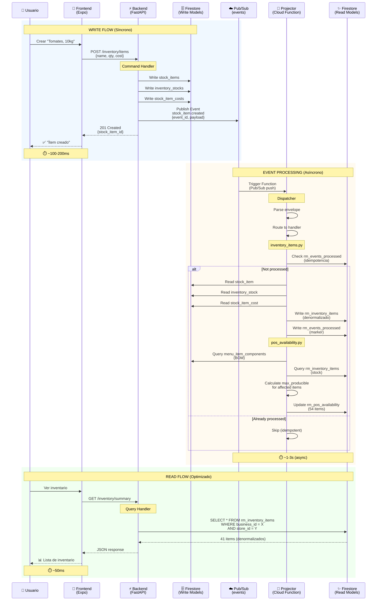
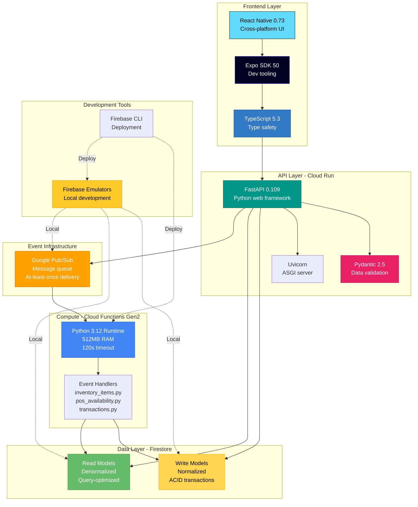
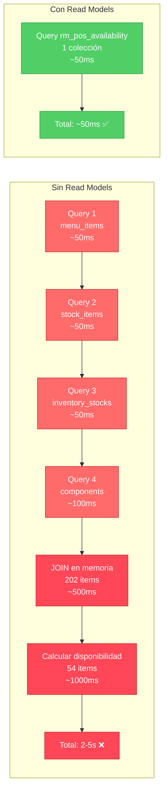
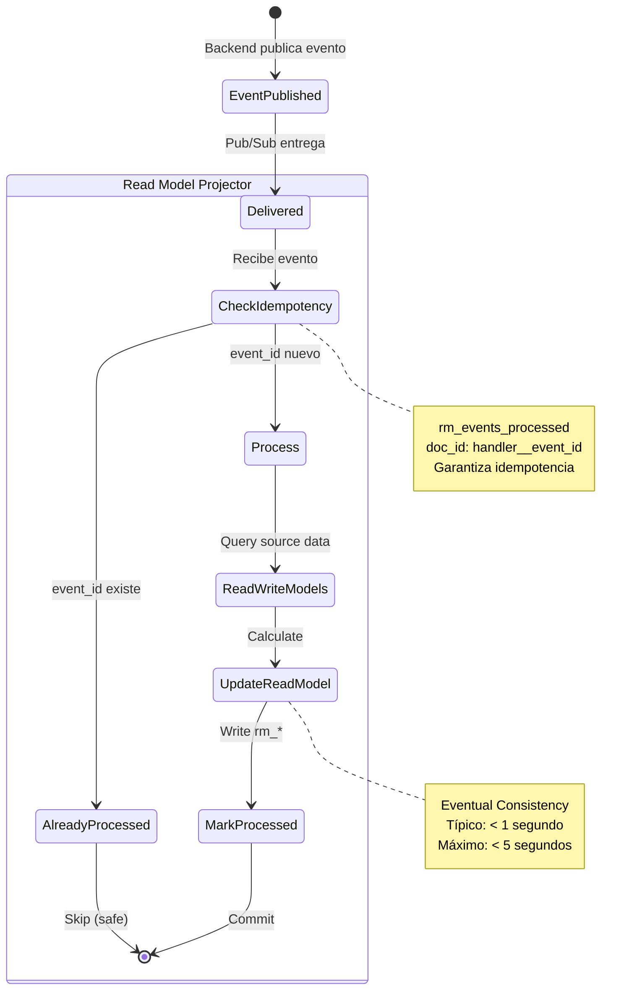
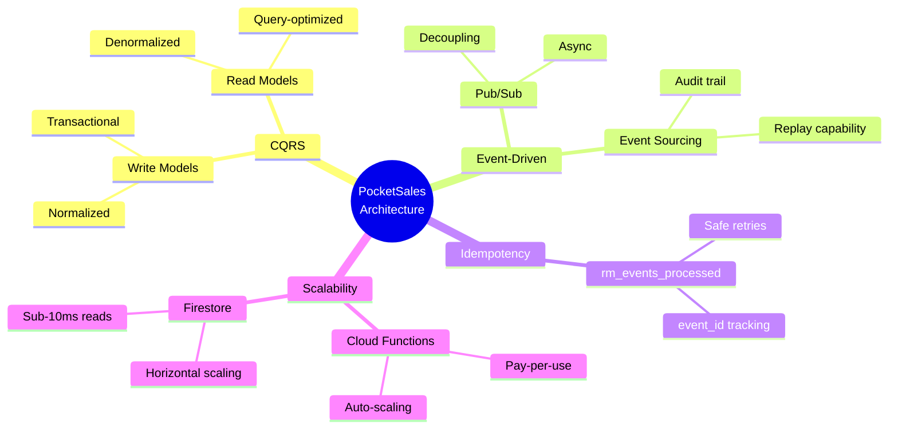

# PocketSales — Diagramas de Arquitectura

**Última actualización**: 2025-12-28  
**Versión**: 2.0 (Event-Driven con Read Models)

---

## 📊 Comparación: Con vs Sin Read Models

### ❌ Arquitectura SIN Read Models (Problemática)

**Problemas:**
- ❌ **4 queries** por cada request
- ❌ **JOINs en memoria** (202 componentes)
- ❌ **Cálculos en runtime** (54 items)
- ❌ **Latencia alta**: 2-5 segundos
- ❌ **Carga en backend**: CPU + memoria
- ❌ **No escalable**: Crece con datos

---

## ✅ Arquitectura CON Read Models (Actual)

### Flujo Completo: Write → Event → Read

**Beneficios:**
- ✅ **1 query** por request (vs 4)
- ✅ **Sin JOINs** (datos denormalizados)
- ✅ **Sin cálculos** (pre-calculados)
- ✅ **Latencia baja**: ~50ms (vs 2-5s)
- ✅ **Backend ligero**: Solo queries
- ✅ **Escalable**: Async processing

---

## 🔄 Flujo Detallado: Crear Ítem de Inventario

---

## 🏗️ Stack Tecnológico Completo

---

## 📈 Comparación de Performance

**Mejora**: **40-100x más rápido** 🚀

---

## 🔒 Garantías de Consistencia

**Garantías:**
- ✅ **At-least-once delivery** (Pub/Sub)
- ✅ **Idempotencia** (rm_events_processed)
- ✅ **Eventual consistency** (< 1s típico)
- ✅ **No duplicados** (event_id único)

---

## 🎯 Patrones de Diseño Aplicados

---

## 📊 Read Models Actuales

| Read Model | Docs | Propósito | Latencia |
|-----------|------|-----------|----------|
| `rm_inventory_items` | 41 | Inventario denormalizado | ~30ms |
| `rm_pos_availability` | 54 | Disponibilidad POS | ~50ms |
| `rm_menu_item_bom` | 202 | BOM forward index | ~40ms |
| `rm_bom_index` | 202 | BOM reverse index | ~40ms |
| `rm_tx_headers` | N | Headers de transacciones | ~30ms |
| `rm_tx_lines` | N | Líneas de transacciones | ~30ms |

**Total**: 6 read models activos

---

## 🚀 Ventajas de la Arquitectura Actual

### Performance
- ✅ **40-100x más rápido** en queries
- ✅ **Latencia predecible** (~50ms)
- ✅ **Escalabilidad horizontal** automática

### Mantenibilidad
- ✅ **Separación de concerns** (CQRS)
- ✅ **Fácil agregar nuevos read models**
- ✅ **Testeable** (event-driven tests)

### Confiabilidad
- ✅ **Idempotencia** garantizada
- ✅ **Retry automático** (Pub/Sub)
- ✅ **Audit trail** completo

### Costos
- ✅ **Pay-per-use** (Cloud Functions)
- ✅ **Scale-to-zero** cuando idle
- ✅ **Menos CPU** en backend

---

**Versión**: 2.0  
**Última actualización**: 2025-12-28  
**Mantenedor**: Equipo PocketSales
